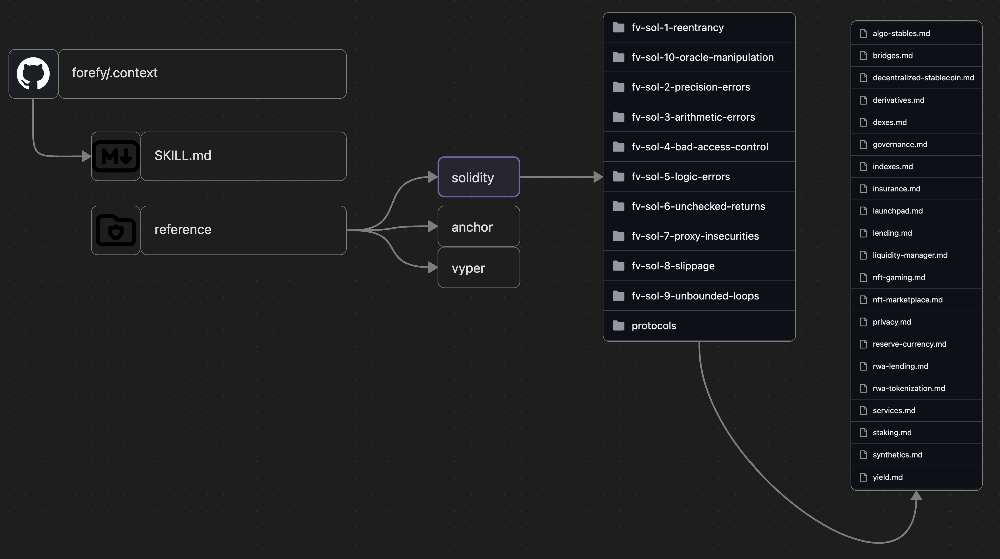

# AI Agent Skills for Security Auditing

<p align="center">
  <a href="https://github.com/forefy/.context/issues/new/choose"></a>
  
  
  
  <a href="https://twitter.com/forefy"></a>
</p>

<p align="center">
 <a href="https://t.me/forefy_t" title="forefy Telegram">Telegram DM</a>
</p>

## Quick Start

```bash
curl -fsSL https://raw.githubusercontent.com/forefy/.context/main/install.sh | bash
```

- The installer will prompt for your agent harness and install location:
  - **Global** - skills installed to `~/.claude/skills/`
  - **Current project** - skills installed to `.claude/skills/`
- Next time you are auditing with an AI agent, the agent harness will automatically know when to read the skill files and invoke its magic

You can also use `npx skills add forefy/.context` but vercel's skills registry is less optimal

<br>

## What is this?

Security auditing skills for AI agents, adhering to the [Agent Skills Format](https://platform.claude.com/docs/en/agents-and-tools/agent-skills/overview).

`.context` is one of the oldest efforts by security researchers to share auditing knowledge directly to your AI agent, and is built gradually over time. at the most simple form, you type "audit this contract" and end up with a multi-agent triaged AI report.

<p align="center">

<br><br>
<span style="font-size: 24px;">↓</span>
<br><br>

<br><br>
<span style="font-size: 24px;">↓</span>
<br><br>

</p>

<br>

## Usage

###  Claude Code &nbsp;·&nbsp;  Copilot CLI &nbsp;·&nbsp;  Gemini CLI &nbsp;·&nbsp;  Codex

Skills are auto-installed to `.claude/skills/` (or `.agents/skills/`) and invoked via textual inference when you request to audit a codebase, for example:

```
> Audit this codebase with the scope of @file.sol
```

<br>

###  GitHub Copilot (VSCode IDE)

Skills are auto-installed to `.claude/skills/` and referenced by name:

```
@smart-contract-security-audit
```

Custom slash commands are auto-installed to `.github/prompts/`:

```
/generate_audit_report_generic
```

<br>

## About the Skills

**Comprehensive audit skills**

Skills are meant to run in specific invokations and be context-budgeted as much as possible. However, skills aren't good in sharing memory, hence a single flow (at the 5,000 token cap recommendation by anthropic) can be powerful for a comprehensive AI audit experience.

- `smart-contract-security-audit` - Full smart contract audit framework with multi-expert analysis for Solidity, Anchor, Vyper, TON (FunC/Tact), and Sui (Move). Includes language-specific checks and vulnerability pattern references.
  <p align="center">
  
  </p>
- `infrastructure-security-audit` - Infrastructure security audit framework for IaC, Docker, Kubernetes, and cloud configurations.

**Workflow skills**

Workflow skills are designed to be picked up naturally as you pick through a codebase in your auditing process, and fill strategically concised context into a specific task.

- `auditor-quiz` - Quick skill to get yourself engaged with the codebase from a security auditor perspective (but also from protocol dev perspective) and test how well you memorized it by quizing yourself.

- `agent-onboarding` - agents are pre-instructed to get familiar with the code before anything, but also tracka. shared TODO.md - when you are in focus mode in your auditing you should have at least 4 concurrent AI terminals running. To sync their work, as well as keep quality coverage tracking of your audit, you can onboard agents to the team with a purpose (e.g. "Onboard to team to look for issues in recent commits only")

<br>

Skills follow the [Agent Skills open standard](https://github.com/agentskills/agentskills) - compatible with both GitHub Copilot and Claude Code.

Each skill is a directory with:

- `SKILL.md` - Main framework and instructions
- Language-specific reference files (loaded as needed for token efficiency)
- `reference/` - Vulnerability patterns organized by language, protocol etc. Skills automatically reference these patterns during audits using progressive disclosure for token efficiency.

<br>

## Outputs

Audits generate numbered folders in `.context/outputs/`:

- `audit-report.md` - Security findings
- `audit-context.md` - Scope and assumptions
- `audit-debug.md` - Technical analysis log

<br>

## Contributors

<table>
<tr>
    <td align="center">
        <a href="https://github.com/forefy">
            
            <br />
            <sub><b>forefy</b></sub>
        </a>
    </td>
</tr>
</table>

Your research knowledge is the only skill required to contribute, whether its a methodology, specific knowledge on a protocol or language or even corrections - everything's highly welcome! help secure and improve the community!
