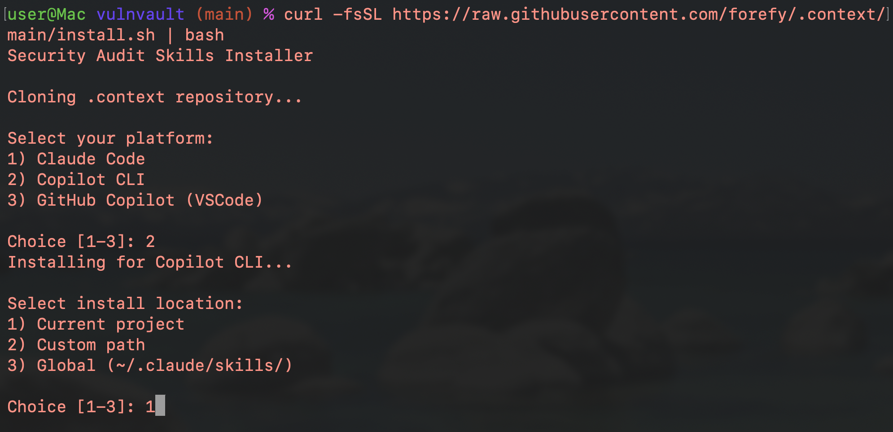
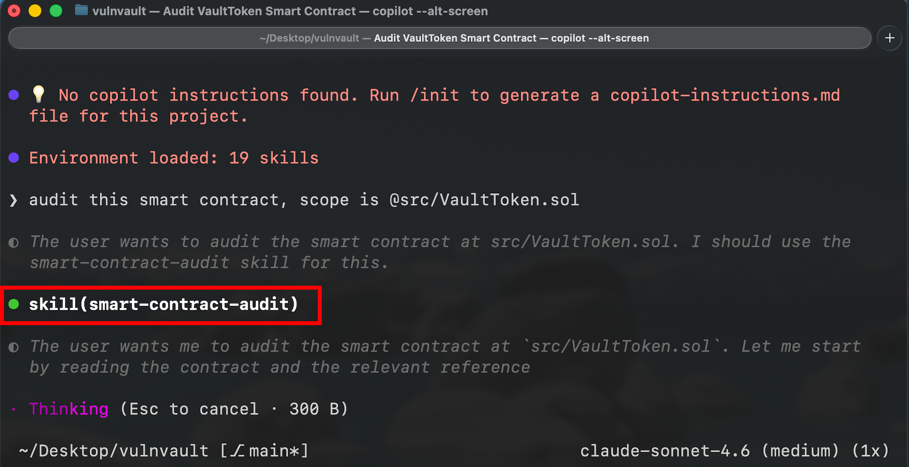
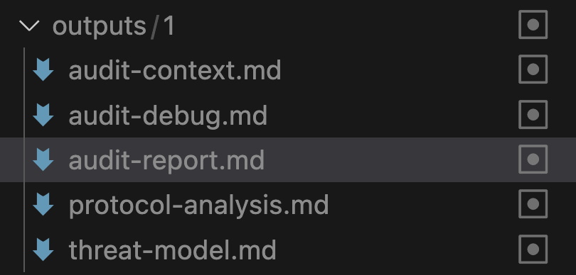

# AI Agent Skills for Security Auditing

<p align="center">
<a href="https://github.com/forefy/.context/edit/main/skills/smart-contract-security-audit.md"></a>

<a href="https://twitter.com/forefy"></a>

</p>

## Quick Start

```bash
curl -fsSL https://raw.githubusercontent.com/forefy/.context/main/install.sh | bash
```

The installer will prompt you to select your platform and automatically configure everything.

<br>

## What is this?

Security audit skills for AI agents. Turn GitHub Copilot, Claude Code, or any coding agent into a specialized security auditor.

<p align="center">

<br><br>
<span style="font-size: 24px;">↓</span>
<br><br>

<br><br>
<span style="font-size: 24px;">↓</span>
<br><br>

</p>

<br>

## Usage
###  Claude Code  /   Copilot CLI

Skills are auto-installed to `.claude/skills/` and invoked via textual inference when you request to audit a codebase, for example:
```
> Audit this codebase with the scope of @file.sol
```
<br>

###  GitHub Copilot (VSCode IDE)

Skills are auto-installed to `.claude/skills/` and referenced by name:

```
@smart-contract-security-audit
```

Custom slash commands are auto-installed to `.github/prompts/`:

```
/generate_audit_report_generic
```

<br>

## About the Skills

Skills follow the [Agent Skills open standard](https://github.com/agentskills/agentskills) - compatible with both GitHub Copilot and Claude Code.

**Comprehensive Audits:**

- `smart-contract-security-audit` - Full smart contract audit framework with multi-expert analysis for Solidity, Anchor, and Vyper. Includes language-specific checks and vulnerability pattern references.
- `infrastructure-security-audit` - Infrastructure security audit framework for IaC, Docker, Kubernetes, and cloud configurations.

Each skill is a directory with:

- `SKILL.md` - Main framework and instructions
- Language-specific reference files (loaded as needed for token efficiency)
- `reference/` - Vulnerability patterns organized by language, protocol etc. Skills automatically reference these patterns during audits using progressive disclosure for token efficiency.

<br>

## Outputs

Audits generate numbered folders in `.context/outputs/`:

- `audit-report.md` - Security findings
- `audit-context.md` - Scope and assumptions
- `audit-debug.md` - Technical analysis log

<br>

## Contributors

<table>
<tr>
    <td align="center">
        <a href="https://github.com/forefy">
            
            <br />
            <sub><b>forefy</b></sub>
        </a>
    </td>
</tr>
</table>


Your research knowledge is the only skill required to contribute, whether its a methodology, specific knowledge on a protocol or language or even corrections - everything's highly welcome! help secure and improve the community!