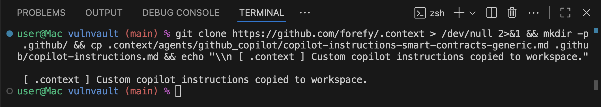
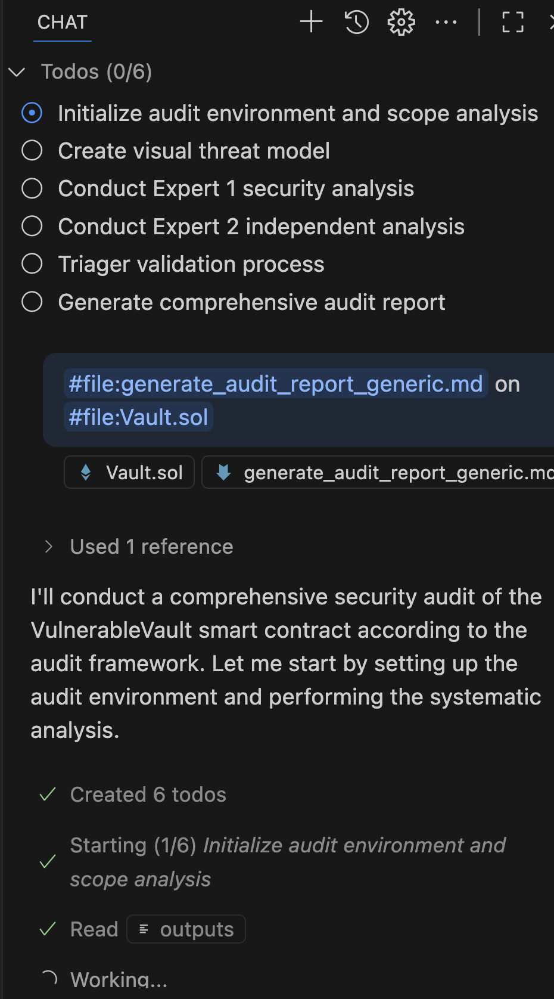

# AI Agent Instructions for Security Auditing

<p align="center">
<a href="https://github.com/forefy/.context/edit/main/skills/smart-contract-security-audit.md"></a>

<a href="https://twitter.com/forefy"></a>

</p>

## Quick Start

```bash
curl -fsSL https://raw.githubusercontent.com/forefy/.context/main/install.sh | bash
```

The installer will prompt you to select your platform and automatically configure everything.

## What is this?

Security audit instructions for AI agents. Turn GitHub Copilot, Claude Code, or any coding agent into a specialized security auditor.

<p align="center">

<br><br>
<span style="font-size: 24px;">↓</span>
<br><br>

<br><br>
<span style="font-size: 24px;">↓</span>
<br><br>

</p>

## Usage

###  Copilot CLI (`copilot`)

Skills are auto-installed to `.claude/skills/` and referenced by name:

```bash
@smart-contract-security-audit Review this Solidity project
```

Skills use the [Agent Skills open standard](https://github.com/agentskills/agentskills).

###  GitHub Copilot (VSCode/IDE)

Skills are auto-installed to `.claude/skills/` and referenced by name:

```
@smart-contract-security-audit
```

Custom slash commands are auto-installed to `.github/prompts/`:

```
/generate_audit_report_generic
```

###  Claude Code

Skills are auto-installed to `.claude/skills/` and referenced by name:

```bash
@smart-contract-security-audit
```

## Available Skills

Skills follow the [Agent Skills open standard](https://github.com/agentskills/agentskills) - compatible with both GitHub Copilot and Claude Code.

**Comprehensive Audits:**

- `smart-contract-security-audit` - Full smart contract audit framework with multi-expert analysis for Solidity, Anchor, and Vyper. Includes language-specific checks and vulnerability pattern references.
- `infrastructure-security-audit` - Infrastructure security audit framework for IaC, Docker, Kubernetes, and cloud configurations.

Each skill is a directory with:

- `SKILL.md` - Main framework and instructions
- Language-specific reference files (loaded as needed for token efficiency)
- `reference/` - Vulnerability patterns organized by language

## Prompts

Custom slash commands for Copilot (auto-installed to `.github/prompts/`):

- `/generate_audit_report_generic` - Create comprehensive audit docs
- `/consolidate_audit_reports` - Merge multiple audit runs
- `/triage_audit_findings_generic` - Validate and filter findings

## Vulnerability Patterns

Vulnerability patterns are organized within each skill's `reference/` directory:

- `smart-contract-security-audit/reference/solidity/` - Solidity vulnerability patterns (fv-sol-X)
- `smart-contract-security-audit/reference/anchor/` - Anchor/Solana patterns (fv-anc-X)
- `smart-contract-security-audit/reference/vyper/` - Vyper patterns (fv-vyp-X)

Skills automatically reference these patterns during audits using progressive disclosure for token efficiency.

## Output

Audits generate numbered folders in `.context/outputs/`:

- `audit-report.md` - Security findings
- `audit-context.md` - Scope and assumptions
- `audit-debug.md` - Technical analysis log
