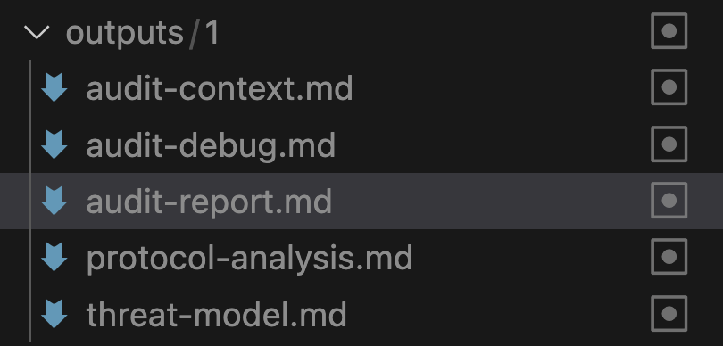

# AI Agent Instructions for Security Auditing

<p align="center">
<a href="https://github.com/forefy/.context/edit/main/skills/smart-contract-security-audit.md"></a>

<a href="https://twitter.com/forefy"></a>

</p>

## What is this?

Security audit instructions for AI agents. Turn GitHub Copilot, Claude Code, or any coding agent into a specialized security auditor.

<p align="center">

<br><br>
<span style="font-size: 24px;">↓</span>
<br><br>

<br><br>
<span style="font-size: 24px;">↓</span>
<br><br>

</p>

## Quick Start

```bash
curl -fsSL https://raw.githubusercontent.com/forefy/.context/main/install.sh | bash
```

The installer will prompt you to select your platform and automatically configure everything.

## Usage

### Copilot CLI (`gh copilot`)

Skills are auto-installed to `.claude/skills/` and referenced by name:
```bash
@security-review-solidity Review contract changes
```

Note: Copilot CLI doesn't support custom prompts (`.github/prompts/`) yet. Use built-in commands.

Skills use the [Agent Skills open standard](https://github.com/agentskills/agentskills).

[Learn more about Copilot CLI](https://docs.github.com/en/copilot/using-github-copilot/using-github-copilot-in-the-command-line)

### GitHub Copilot (VSCode/IDE)

Skills are auto-installed to `.claude/skills/` and referenced by name:
```
@security-review-solidity
```

Custom slash commands are auto-installed to `.github/prompts/`:
```
/generate_audit_report_generic
```

Instructions auto-load from `.github/copilot-instructions.md`.

[Learn more about Copilot Chat](https://docs.github.com/en/copilot/using-github-copilot/asking-github-copilot-questions-in-your-ide)

### Claude Code

Skills are auto-installed to `.claude/skills/` and referenced by name:
```bash
@security-review-solidity
```

Or run as custom command:
```bash
claude audit
```

[Learn more about Claude Code](https://docs.anthropic.com/en/docs/developer-tools)

## Available Skills

Skills follow the [Agent Skills open standard](https://github.com/agentskills/agentskills) - compatible with both GitHub Copilot and Claude Code.

**Comprehensive Audits:**
- `smart-contract-security-audit` - Full smart contract audit framework
- `infrastructure-security-audit` - Infrastructure security audit framework

**Quick Reviews:**
- `security-review-solidity` - Solidity security review
- `security-review-anchor` - Anchor/Solana security review
- `security-review-vyper` - Vyper security review

Each skill is a directory with a `SKILL.md` file containing YAML frontmatter and instructions.

## Prompts

Custom slash commands for Copilot (auto-installed to `.github/prompts/`):
- `/generate_audit_report_generic` - Create comprehensive audit docs
- `/consolidate_audit_reports` - Merge multiple audit runs
- `/triage_audit_findings_generic` - Validate and filter findings

[Learn more about custom prompts](https://code.visualstudio.com/docs/copilot/customization/prompt-files)

## Knowledge Bases

`knowledgebases/` contains vulnerability patterns for Solidity, Anchor, and Vyper. Skills automatically reference these during audits.

## Output

Audits generate numbered folders in `.context/outputs/`:
- `audit-report.md` - Security findings
- `audit-context.md` - Scope and assumptions
- `audit-debug.md` - Technical analysis log